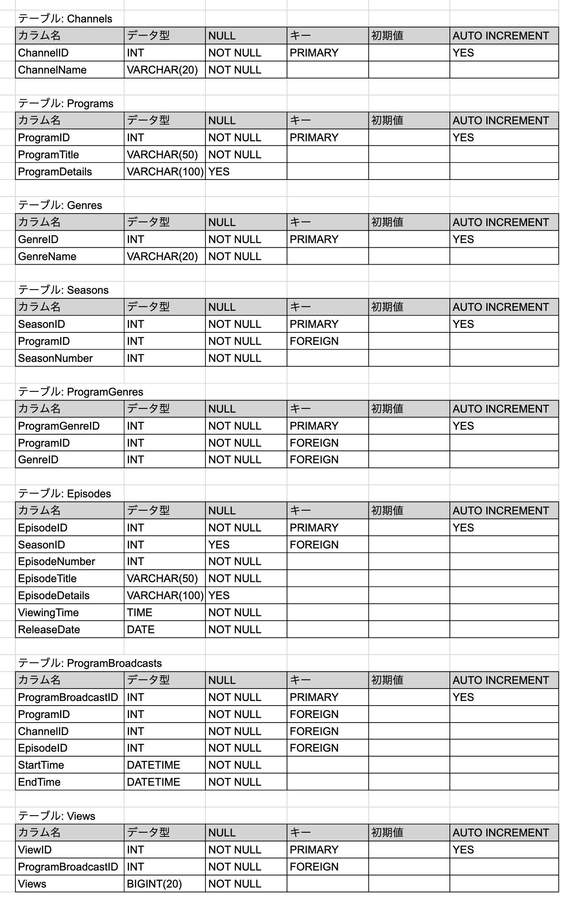

# インターネットTV

好きな時間に好きな場所で動画を楽しめる「インターネットTVサービス」を想定して、データベースの構築とデータを取得するSQL文の実行を行います。

## テーブル設計の図



## テーブルを構築する

実際にテーブルを構築してみましょう。

1. ターミナルからMySQLコマンドラインクライアントを起動します。「user_name」は実際のユーザー名に置き換えてください。

```console
mysql --user=user_name --password
```

MySQLのコンソールが表示されたら成功です。

```sql
mysql>
```

2. データベースを作ります。

```sql
CREATE DATABASE sample_db;
```

3. 作成したデータベースに移動します。

```sql
USE sample_db;
```

4. データベースにテーブルを作ります。
<br />
テーブルを作るためのSQL文を記述したファイルは「create_tables.sql」であり、`source`コマンドでこれを読み込みましょう。※ファイルの場所を指定する点に注意してください。

```sql
source /ファイルのパス/create_tables.sql
```

5. 先ほど作成したテーブルに、サンプルデータを追加します。
<br />
サンプルデータをテーブルに追加するためのSQL文を記述したファイルは「add_data.sql」です。`source`コマンドでこれを読み込みましょう。

```sql
source /ファイルのパス/add_data.sql
```

## クエリ(問い合わせ)の実行

それでは、欲しいデータを取得するためのクエリを実行していきます。以下のコードをコピーして貼り付けを行うことで、クエリが実行され、結果が表示されます。

1. よく見られているエピソードを知りたいです。エピソード視聴数トップ3のエピソードタイトルと視聴数を取得してください

```sql
SELECT e.EpisodeTitle,
	   v.Views
  FROM ProgramBroadcasts AS pb
  JOIN Episodes AS e
	ON pb.EpisodeID = e.EpisodeID
  JOIN Views AS v
	ON pb.ProgramBroadcastID = v.ProgramBroadcastID
 ORDER BY v.Views DESC
 LIMIT 3;
```

2. よく見られているエピソードの番組情報やシーズン情報も合わせて知りたいです。エピソード視聴数トップ3の番組タイトル、シーズン数、エピソード数、エピソードタイトル、視聴数を取得してください

```sql
SELECT p.ProgramTitle,
	   s.SeasonNumber,
	   e.EpisodeNumber,
	   e.EpisodeTitle,
	   v.Views
  FROM ProgramBroadcasts AS pb
  JOIN Episodes AS e
	ON pb.EpisodeID = e.EpisodeID
  JOIN Views AS v
	ON pb.ProgramBroadcastID = v.ProgramBroadcastID
  JOIN Seasons AS s
	ON s.SeasonID = e.SeasonID
  JOIN Programs AS p
	ON p.ProgramID = s.ProgramID
 ORDER BY v.Views DESC
 LIMIT 3;
```

3. 本日の番組表を表示するために、本日、どのチャンネルの、何時から、何の番組が放送されるのかを知りたいです。本日放送される全ての番組に対して、チャンネル名、放送開始時刻(日付+時間)、放送終了時刻、シーズン数、エピソード数、エピソードタイトル、エピソード詳細を取得してください。なお、番組の開始時刻が本日のものを本日方法される番組とみなすものとします

```sql
SELECT
	c.ChannelName,
	pb.StartTime,
	pb.EndTime,
	e.EpisodeNumber,
	e.EpisodeTitle,
	e.EpisodeDetails
FROM
	ProgramBroadcasts AS pb
	JOIN
	Channels AS c
	ON pb.ChannelID = c.ChannelID
	JOIN
	Episodes AS e
	ON e.EpisodeID = pb.EpisodeID
WHERE
	pb.StartTime >= '2024-11-03 00:00:00'
  AND pb.StartTime < '2024-11-04 00:00:00';
```

4. ドラマというチャンネルがあったとして、ドラマのチャンネルの番組表を表示するために、本日から一週間分、何日の何時から何の番組が放送されるのかを知りたいです。ドラマのチャンネルに対して、放送開始時刻、放送終了時刻、シーズン数、エピソード数、エピソードタイトル、エピソード詳細を本日から一週間分取得してください

```sql
SELECT
	pb.StartTime,
	pb.EndTime,
	s.SeasonNumber,
	e.EpisodeNumber,
	e.EpisodeTitle,
	e.EpisodeDetails
FROM
	ProgramBroadcasts AS pb
	JOIN
	Episodes AS e
	ON e.EpisodeID = pb.EpisodeID
	JOIN
	Channels AS c
	ON c.ChannelID = pb.ChannelID
	JOIN
	Seasons AS s
	ON e.SeasonID = s.SeasonID
WHERE
	-- 絞り込み条件: チャンネル名が「ドラマ〜」である
	c.ChannelName LIKE 'ドラマ%'
	AND
	-- 絞り込み条件: 放送開始時刻が本日から一週間分
	pb.StartTime >= '2024-11-03 00:00:00'
	AND
	pb.StartTime < '2024-11-10 00:00:00';
```

5. 直近一週間で最も見られた番組が知りたいです。直近一週間に放送された番組の中で、エピソード視聴数合計トップ2の番組に対して、番組タイトル、視聴数を取得してください

```sql
SELECT
	p.ProgramTitle,
	v.Views
FROM
	ProgramBroadcasts AS pb
	JOIN
	Views AS v
	ON v.ProgramBroadcastID = pb.ProgramBroadcastID
	JOIN
	Programs AS p
	ON p.ProgramID = pb.ProgramID
WHERE
	-- 一週間前から現在まで
	pb.StartTime >= '2024-10-27 00:00:00'
	AND
	pb.EndTime <= '2024-11-03 00:00:00'
ORDER BY v.Views DESC
LIMIT 2;
```
